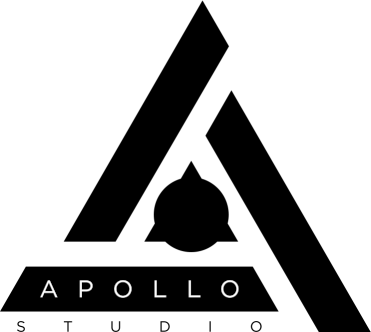

# Apollo Studio

### Fly your Launchpad to the moon. ☆.。.:*・°☆

Apollo Studio is a standalone editor and live playback engine for Launchpad light effects, inspired by the traditional workflow of Ableton Live. The innovation lies in support for true RGB colors (all 262k of them!), an improved workflow and better resource management. Apollo Studio has no audio capabilities whatsoever, as it's designed to run alongside Ableton Live which has proven its robustness when it comes to running audio-related tasks. Taking all that load off Live's engine should improve audio quality and input lag, too. Apollo Studio takes full advantage of the multithreading capabilities of modern processors and also allows for adjusting the intensity of the light effects globally, making sure everyone can run all project files as much as their setup can support them.

Apollo Studio solves all the problems we experience every day in Live including the unintuitive workflow, limited color palette, inconsistent undo behavior, differences between Launchpad models, CPU lag, large RAM usage and more; while bringing new and revolutionary features to the table.

## Demonstration

Here are a few Launchpad covers created by early testers entirely in Apollo Studio. See for yourself what our software is capable of even when using early, unfinished versions.

")

")

")

## Getting Started

Unfortunately, Apollo Studio is not quite ready for public use yet, so we'll have to ask you to be patient and wait a little more.

## Documentation and Support

You can take a look at the [GitHub Wikis](../../wiki) for all documentation on Apollo Studio. Everything you might ask for should be documented there. If it isn't, feel free to ask in our Discord server, or open an issue.

## Special thanks

You are the people who make Apollo Studio possible.

* [vaaski](https://vaa.ski/) for expressing interest early in the project, even if it didn't work out ultimately; and maintaining the website for the project.
* [LaunchpadLights](http://www.launchpadlights.com/) for sparking some bright ideas and designing the logo and artwork for the project.
* [rpg.aleksy](https://www.youtube.com/channel/UC209YLY-uQPy4U2Gu6sqaVw) for keeping me sane while I worked full days without a break.
* [Avalonia](https://github.com/avaloniaui/) developers for the only robust cross-platform C# UI framework.
* [Michael Dahl](https://github.com/micdah/) for his work on RtMidi.Core, bringing easy cross-platform MIDI communication to C#; and accepting my improvements to his library.
* All other early testers and the rest of the Launchpad community for helping make Apollo Studio better.
